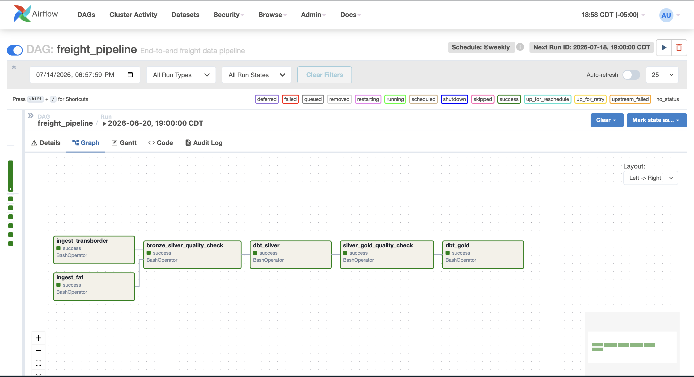
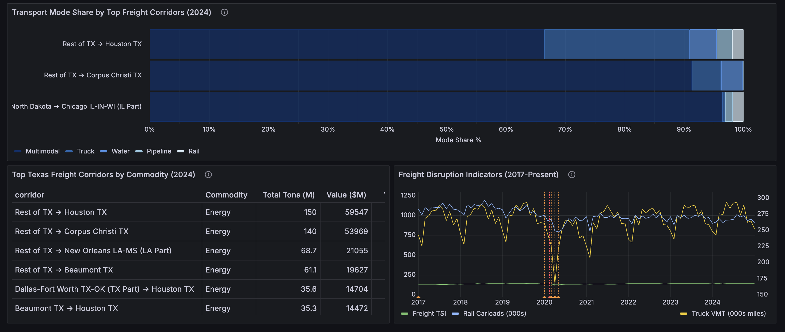

<!-- PROJECT LOGO -->
<div align="center">

<p>
  
</p>

<!-- Header -->
<h1 align="center">Freight Flow Intelligence Platform </h1>


</div>


A production-grade data pipeline and analytics platform that ingests U.S. freight flow data  from the BTS Freight Analysis Framework (FAF5), transforms it through a medallion architecture (bronze → silver → gold), and surfaces corridor-level insights via a Grafana dashboard.

---

## Architecture


## Screenshots

### Airflow PipelineS

*Figure 1: Airflow DAG*


### Grafana Dashboard

*Figure 2: Corridor scorecard and commodity trends*


*Figure 3: Mode share and disruption indicators*

---

## Quickstart

### Prerequisites

- Docker Desktop
- Python 3.11+
- [uv](https://github.com/astral-sh/uv)
- make

### 1. Clone and configure

```bash
git clone https://github.com/yourusername/freight-flow-platform.git
cd freight-flow-platform
cp .env.example .env
# Fill in your values in .env
```

### 2. Start infrastructure

```bash
make up
```

This starts PostgreSQL, Airflow, MinIO, and Grafana via Docker Compose.

| Service   | URL                   | Credentials              |
|-----------|-----------------------|--------------------------|
| Airflow   | http://localhost:8080 | See `.env` AIRFLOW_ADMIN |
| MinIO     | http://localhost:9001 | See `.env` MINIO_ROOT    |
| Grafana   | http://localhost:3000 | See `.env` GRAFANA_ADMIN |

### 3. Install Python dependencies

```bash
make install
```

### 4. Run ingestion

# FAF5 (downloads automatically)
python -m src.ingestion.faf_ingestor

# TransBorder (requires manual download — see Data Sources below)
python -m src.ingestion.transborder_ingestor

# Supply Chain Indicators (downloads automatically)
python -m src.ingestion.indicators

### 5. Run dbt transforms

cd dbt/freight_flow
dbt build --target dev

### 6. Open Grafana

Navigate to http://localhost:3000 — the dashboard auto-loads via provisioning.

---

## Tech Stack

| Layer         | Technology              | Version                       |
|---------------|-------------------------|-------------------------------|
| Orchestration | Apache Airflow          | 2.9.0                         |
| Object Storage| MinIO                   | RELEASE.2025-09-07T16-13-09Z  |
| Database      | PostgreSQL              | 16.14                         |
| Transforms    | dbt-core + dbt-postgres | 1.11.11                       |
| Data Quality  | Great Expectations      | 1.18.2                        |
| Ingestion     | Python + boto3 + pandas | 3.11.15                       |
| Monitoring    | Grafana                 | 11.0.0                        |
| Containers    | Docker Compose          | v5.1.3                        |
| CI/CD         | GitHub Actions          | —                             |
| Package Mgmt  | uv                      | 0.11.14                       |

---

## Data Sources

### BTS Freight Analysis Framework (FAF5)
- **URL:** https://faf.ornl.gov/faf5
- **File:** FAF5.7.1.zip (~291 MB CSV)
- **Coverage:** 2017–2024 actuals + forecasts to 2050
- **Update cadence:** Quarterly
- **Download:** Automated via ingestion pipeline

### BTS TransBorder Freight Data
- **URL:** https://www.bts.gov/topics/transborder-raw-data
- **Coverage:** Monthly cross-border freight by commodity, state, and transport mode
- **Update cadence:** Monthly
- **Download:** ⚠️ Manual download required (see note below)

> **Note on TransBorder downloads:** The BTS website is protected by Akamai's bot detection, which blocks automated HTTP requests. Files must be downloaded manually from the BTS website and saved to `data/raw/transborder/` following this naming convention:
> ```
> data/raw/transborder/transborder_{yyyy}_{mm}.zip
> ```
> Example: `transborder_2026_03.zip` for March 2026.

### BTS Transportation Services Index (TSI)
- **URL:** https://data.bts.gov/Research-and-Statistics/Transportation-Services-Index-and-Seasonally-Adjus/bw6n-ddqk
- **Coverage:** Monthly freight TSI, truck VMT, rail carloads, pipeline throughput since 2000
- **Update cadence:** Monthly
- **Download:** Automated via ingestion pipeline

---

## Repository Structure

```
freight-flow-platform/
├── docker-compose.yml
├── Dockerfile
├── .env.example
├── Makefile
├── README.md
├── pyproject.toml
├── uv.lock
├── .gitignore
├── init-db/
│   ├── 01_create_schemas.sql          # raw, silver, gold schemas
│   └── 02_create_raw_tables.sql       # raw.faf_shipments, raw.transborder_freight, raw.supply_chain_indicators
├── src/
│   ├── __init__.py
│   ├── ingestion/
│   │   ├── __init__.py
│   │   ├── base.py                    # IngestorBase abstract class
│   │   ├── faf_ingestor.py            # FAF bulk CSV ingestion
│   │   ├── transborder_ingestor.py    # TransBorder monthly ingestion (manual download)
│   │   ├── indicators.py              # BTS TSI ingestion
│   │   └── bronze_loader.py           # MinIO → Postgres raw schema loader
│   ├── quality/
│   │   ├── __init__.py
│   │   ├── bronze_silver_checkpoint.py  # GE gate: raw → silver
│   │   └── silver_gold_checkpoint.py    # GE gate: silver → gold
│   └── utils/
│       ├── __init__.py
│       ├── s3_client.py               # MinIO/S3 client wrapper
│       └── manifest.py                # SHA-256 hashing + manifest.json tracking
├── dbt/
│   └── freight_flow/
│       ├── dbt_project.yml
│       ├── profiles.yml
│       ├── packages.yml
│       ├── models/
│       │   ├── staging/
│       │   │   ├── stg_faf_shipments.sql
│       │   │   ├── stg_faf_shipments_long.sql
│       │   │   ├── stg_transborder_freight.sql
│       │   │   ├── stg_supply_chain_indicators.sql
│       │   │   └── schema.yml
│       │   └── marts/
│       │       ├── fct_corridor_flows.sql
│       │       ├── fct_commodity_trends.sql
│       │       ├── fct_mode_share.sql
│       │       ├── fct_trade_corridor_scorecard.sql
│       │       ├── fct_disruption_indicators.sql
│       │       └── schema.yml
│       ├── seeds/
│       │   ├── dim_regions.csv
│       │   ├── dim_commodities.csv
│       │   └── dim_transport_modes.csv
│       └── macros/
│           └── generate_schema_name.sql
├── airflow/
│   └── dags/
│       └── freight_pipeline.py        # ingest → GE gate → dbt silver → GE gate → dbt gold
├── grafana/
│   ├── dashboards/
│   │   ├── dashboard.yml              # provisioning config
│   │   └── freight_intelligence.json  # 5-panel dashboard
│   └── datasources/
│       └── postgres.yml               # Postgres connection provisioning
├── docs/
│   ├── architecture.md                # design decisions and trade-offs
│   ├── data-dictionary.md             # column definitions for all gold models
│   └── assets/
│       ├── architecture.png
│       ├── airflow_dag.png
│       ├── grafana_upper_panels.png
│       ├── grafana_lower_panels.png
│       └── US_Department_of_Transportation_logo.png
└── .github/
    └── workflows/
        └── ci.yml                     # ruff, mypy, dbt compile
```

---

## What I Learned

- **Medallion architecture in practice** — the bronze/silver/gold pattern forces clean separation between raw data, validated data, and business-ready aggregations. Each layer has a clear contract.

- **Repeatable pipelines matter** — SHA-256 deduplication means re-running the pipeline never creates duplicate data. This is a non-negotiable property in production.

- **Real business data can be messy** — the TransBorder URL naming inconsistency (`Feb2025.zip` vs `February2025.zip`) is a real-world example of why defensive coding and fallback strategies are essential.

- **Source data can silently fail to be useful** — the initial BTS Supply Chain Indicators API endpoint returned a well-formed CSV that passed schema validation but contained all-zero values for every metric. The pipeline "succeeded" while providing zero analytical value. This led to switching to the BTS Transportation Services Index (TSI) dataset, which required rebuilding the ingestor, silver model, and gold model — but produced real, meaningful signal (the April 2020 COVID disruption is clearly visible with a -3.89 Z-score on truck VMT). The lesson: schema validation alone doesn't guarantee data quality — value distribution checks matter just as much.

- **Bot protection is a real engineering constraint** — the Akamai WAF on BTS blocking automated downloads is a legitimate production scenario. Designing around it (manual download + local processing) is the right call over attempting to circumvent it.

- **Docker Compose ordering matters** — Airflow depends on Postgres being healthy, not just running. The `condition: service_healthy` dependency combined with Postgres healthchecks prevents a whole class of startup race conditions.

