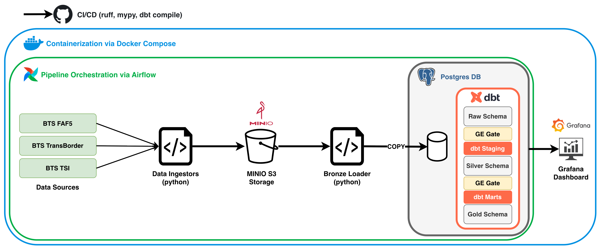
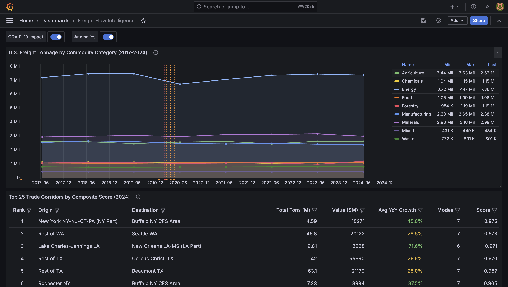

<!-- PROJECT LOGO -->
<div align="center">

<p>
  
</p>

<!-- Header -->
<h1 align="center">Freight Flow Intelligence Platform </h1>


</div>


A production-grade data pipeline and analytics platform that ingests U.S. freight flow data  from the BTS Freight Analysis Framework (FAF5), transforms it through a medallion architecture (bronze → silver → gold), and surfaces corridor-level insights via a Grafana dashboard.

---

## Architecture



## Screenshots

### Airflow Pipeline


### Grafana Dashboard



---

## Quickstart

### Prerequisites

- Docker Desktop
- Python 3.11+
- [uv](https://github.com/astral-sh/uv)
- make

### 1. Clone and configure

```bash
git clone https://github.com/yourusername/freight-flow-platform.git
cd freight-flow-platform
cp .env.example .env
# Fill in your values in .env
```

### 2. Start infrastructure

```bash
make up
```

This starts PostgreSQL, Airflow, MinIO, and Grafana via Docker Compose.

| Service   | URL                   | Credentials              |
|-----------|-----------------------|--------------------------|
| Airflow   | http://localhost:8080 | See `.env` AIRFLOW_ADMIN |
| MinIO     | http://localhost:9001 | See `.env` MINIO_ROOT    |
| Grafana   | http://localhost:3000 | See `.env` GRAFANA_ADMIN |

### 3. Install Python dependencies

```bash
make install
```

### 4. Run ingestion

```bash
# FAF5 (downloads automatically)
python -m src.ingestion.faf_ingestor

# TransBorder (requires manual download — see Data Sources below)
python -m src.ingestion.transborder_ingestor
```

### 5. Run dbt transforms

```bash
cd dbt
dbt build
```

### 6. Open Grafana

Navigate to http://localhost:3000 — the dashboard auto-loads via provisioning.

---

## Tech Stack

| Layer         | Technology              | Version    |
|---------------|-------------------------|------------|
| Orchestration | Apache Airflow          | 2.9+       |
| Object Storage| MinIO                   | Latest     |
| Database      | PostgreSQL              | 16         |
| Transforms    | dbt-core + dbt-postgres | 1.8+       |
| Data Quality  | Great Expectations      | 0.18+      |
| Ingestion     | Python + boto3 + pandas | 3.11       |
| Monitoring    | Grafana                 | 11+        |
| Containers    | Docker Compose          | v2         |
| CI/CD         | GitHub Actions          | —          |
| Package Mgmt  | uv                      | Latest     |

---

## Data Sources

### BTS Freight Analysis Framework (FAF5)
- **URL:** https://faf.ornl.gov/faf5
- **File:** FAF5.7.1.zip (~291 MB CSV)
- **Coverage:** 2017–2024 actuals + forecasts to 2050
- **Update cadence:** Quarterly
- **Download:** Automated via ingestion pipeline

### BTS TransBorder Freight Data
- **URL:** https://www.bts.gov/topics/transborder-raw-data
- **Coverage:** Monthly cross-border freight by commodity, state, and transport mode
- **Update cadence:** Monthly
- **Download:** ⚠️ Manual download required (see note below)

> **Note on TransBorder downloads:** The BTS website is protected by Akamai's bot detection, which blocks automated HTTP requests. Files must be downloaded manually from the BTS website and saved to `data/raw/transborder/` following this naming convention:
> ```
> data/raw/transborder/transborder_{yyyy}_{mm}.zip
> ```
> Example: `transborder_2026_03.zip` for March 2026.

---

## Repository Structure

```
freight-flow-platform/
├── docker-compose.yml
├── .env.example
├── Makefile
├── README.md
├── pyproject.toml
├── docs/
│   ├── architecture.md               # Design decisions and trade-offs
│   └── data-dictionary.md            # Column definitions for all models
├── src/
│   ├── ingestion/
│   │   ├── base.py                   # IngestorBase abstract class
│   │   ├── faf_ingestor.py           # FAF bulk CSV ingestion
│   │   └── transborder_ingestor.py   # TransBorder monthly ingestion
│   ├── quality/
│   │   ├── expectations/             # GE expectation suite JSON files
│   │   └── checkpoints/              # GE checkpoint configs
│   └── utils/
│       ├── s3_client.py              # MinIO/S3 wrapper
│       ├── manifest.py               # SHA-256 hashing + data lineage
├── dbt/
│   ├── models/
│   │   ├── staging/                  # stg_* silver models
│   │   └── marts/                    # fct_* and dim_* gold models
│   ├── seeds/                        # Region codes, commodity codes
│   └── macros/                       # Reusable Jinja macros
├── airflow/
│   └── dags/
│       ├── freight_pipeline.py
│       └── monitoring.py
├── grafana/
│   ├── dashboards/                   # JSON dashboard definitions
│   └── datasources/                  # Provisioning configs
└── .github/workflows/ci.yml
```

---

## What I Learned

- **Medallion architecture in practice** — the bronze/silver/gold pattern forces clean separation between raw data, validated data, and business-ready aggregations. Each layer has a clear contract.

- **Repeatable pipelines matter** — SHA-256 deduplication means re-running the pipeline never creates duplicate data. This is a non-negotiable property in production.

- **Real business data can be messy** — the TransBorder URL naming inconsistency (`Feb2025.zip` vs `February2025.zip`) is a real-world example of why defensive coding and fallback strategies are essential.

- **Bot protection is a real engineering constraint** — the Akamai WAF on BTS blocking automated downloads is a legitimate production scenario. Designing around it (manual download + local processing) is the right call over attempting to circumvent it.

- **Docker Compose ordering matters** — Airflow depends on Postgres being healthy, not just running. The `condition: service_healthy` dependency combined with Postgres healthchecks prevents a whole class of startup race conditions.
